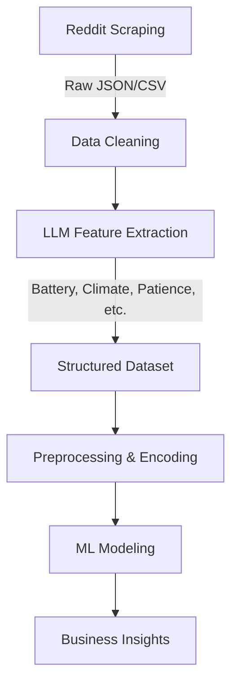

# EV Sentiment Analysis: LLM-Augmented User Satisfaction Study


## 📌 Project Overview
This project focuses on analyzing Electric Vehicle (EV) owner satisfaction by leveraging a hybrid approach that combines **Web Scraping**, **LLM-driven Feature Engineering**, and **Supervised Machine Learning**. 

Instead of traditional survey-based data, we scraped real-world user discussions from Reddit. We then utilized Large Language Models (LLMs) to transform unstructured social media text into a high-quality structured tabular dataset, which was used to train predictive models.

### 🚀 The "Novelty" Factor
While most sentiment analysis projects use black-box models (like BERT) for direct classification, this project uses LLMs as **Structured Feature Extractors**. This allows us to interpret *why* a user is satisfied, linking satisfaction to specific variables like battery chemistry (LFP vs NMC) or charging habits.

---

## 🛠️ Technical Workflow



### 1. Data Acquisition & Cleaning
- **Source:** Scraped subreddits (r/electricvehicles, r/TeslaModel3, etc.) using custom Python scripts.
- **Cleaning:** Implemented a strict signal-to-noise filter, removing records with ≥3 "Unknown" features to ensure high data quality.

### 2. LLM-Augmented Feature Engineering
Used **Groq (Llama-3)** and **Google Gemini** APIs to extract 5 key categorical features from raw text:
- `LLM_Battery`: Battery type (NMC, LFP).
- `LLM_Climate`: User's local climate (Cold, Moderate, Hot).
- `LLM_Commute`: Type of driving (City, Highway, Mixed).
- `LLM_Home_Charging`: Access to home charging.
- `LLM_Patience`: User's perceived patience level regarding charging/range.

### 3. Machine Learning Pipeline
- **Preprocessing:** Bypassed standard scaling in favor of **Ordinal Encoding** (for hierarchical data like Patience) and **One-Hot Encoding** (for nominal data).
- **Class Imbalance:** Handled sentiment distribution challenges using **stratified sampling** and evaluating **Macro/Weighted F1-Scores**.
- **Models Evaluated:** Logistic Regression, KNN, Random Forest, SVM, and **Gradient Boosting**.
- **Optimization:** Hyperparameter tuning via `GridSearchCV` and `RandomizedSearchCV`.

---

## 📊 Key Results & Insights
- **Top Performer:** The **Decision Tree** and **Gradient Boosting** models achieved the best balance, with an **AUC of 0.76**.
- **The "Patience" Insight:** Feature importance analysis revealed that **User Patience** accounts for ~40% of the predictive weight. 
- **Business Impact:** Our data suggests that "wait-time anxiety" is a bigger detractor from satisfaction than the actual battery hardware (LFP vs NMC).

---

## 📂 Project Structure
- `/scripts`: Data scrapers, LLM extractors, and model training scripts.
- `/data`: Raw and processed CSV files (including `final_data12.csv`).
- `/notebooks`: Exploratory Data Analysis (EDA) and model evaluation templates.
- `project_report.pdf`: Detailed technical documentation.

---

## 🔧 Installation & Usage
1. **Clone the Repo:**
   ```bash
   git clone https://github.com/yourusername/ev-sentiment-analysis.git
   ```
2. **Install Dependencies:**
   ```bash
   pip install -r requirements.txt
   ```
3. **Run Inference:**
   ```bash
   python scripts/interactive_predict.py
   ```

---

## 👥 Contributors
- **Keramettin Kutnu** - *Data Scientist / ML Engineer*
- **Yasin Eren Alacahan**
- **Emre Erkut**

---
*Note: This project was developed as part of the COMP4202 Practical Data Science course.*
